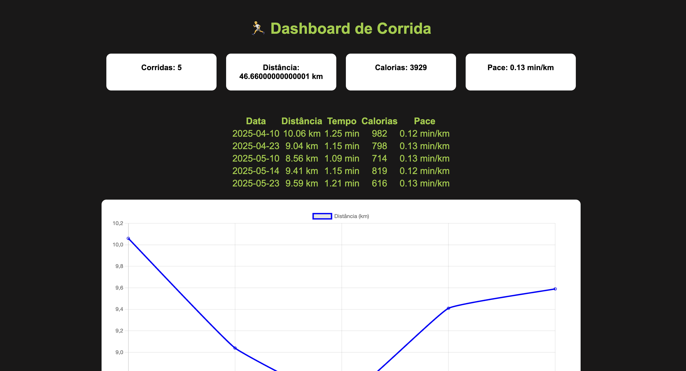
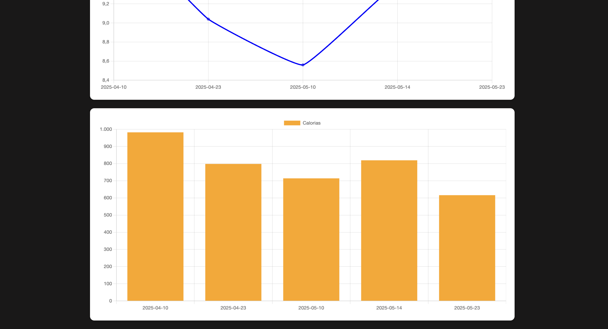

# 🏃‍♀️ Dashboard de Corridas

Este projeto é um **Dashboard interativo de corridas** que registra
treinos, calcula estatísticas como distância total, tempo gasto,
calorias queimadas e pace médio, além de exibir os dados em uma tabela
dinâmica.

------------------------------------------------------------------------

## 📸 Prints do Projeto

### Tela Principal


### Dashboard de Gráfico



------------------------------------------------------------------------

## 🚀 Tecnologias Utilizadas

-   **Frontend:** HTML, CSS, JavaScript\
-   **Backend:** Python (Flask)\
-   **Banco de dados:** CSV (pandas)\
-   **Ferramentas:** Git, GitHub, GitHub Desktop

------------------------------------------------------------------------

## 📂 Estrutura do Projeto

    /dashboard-corridas
    │── /static
    │   └── script.js
    │── /templates
    │   └── index.html
    │── app.py
    │── treino.csv
    │── README.md

------------------------------------------------------------------------

## ⚙️ Como Rodar o Projeto

1.  Clone este repositório:

    ``` bash
    git clone https://github.com/seuusuario/dashboard-corridas.git
    ```

2.  Acesse a pasta do projeto:

    ``` bash
    cd dashboard-corridas
    ```

3.  Crie e ative um ambiente virtual (opcional, mas recomendado):

    ``` bash
    python -m venv venv
    source venv/bin/activate   # Linux/Mac
    venv\Scripts\activate    # Windows
    ```

4.  Instale as dependências:

    ``` bash
    pip install -r requirements.txt
    ```

5.  Rode a aplicação:

    ``` bash
    flask run
    ```

6.  Abra no navegador:

        http://127.0.0.1:5000

------------------------------------------------------------------------

## 📊 Funcionalidades

-   Registro de novos treinos com distância, tempo e calorias.\
-   Cálculo automático de pace médio.\
-   Exibição de estatísticas resumidas.\
-   Tabela dinâmica com histórico de treinos.\
-   Integração entre frontend e backend.

------------------------------------------------------------------------

## ✨ Próximos Passos (To-Do)

-   [ ] Adicionar gráficos com **Chart.js ou Recharts**.\
-   [ ] Implementar autenticação de usuário.\
-   [ ] Criar API REST para integrar com apps mobile.\
-   [ ] Exportar relatórios em PDF/Excel.

------------------------------------------------------------------------

## 👩‍💻 Autora

**Cristina Saraiva**\
🔗 [LinkedIn](https://www.linkedin.com/in/cristina-figueiredo-154858233/) \| 💻
[GitHub](https://github.com/Crisstudy)

------------------------------------------------------------------------

⭐ Se gostou deste projeto, não esqueça de deixar um **star** aqui no
repositório!
